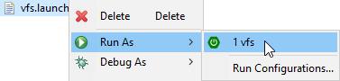

# Launchers

Launchers are here to configure a development environment for a developers needs. E.g. the application works with a logging facade and a logger is not included in the classpath to allow the user to use his one according to his own needs. This is not practical for a developer. Therefore the configuration can be set during development time by utilizing the launchers.

By copying the file "vfs.launch.tpl" to "vfs.launch" and modifying the following line (line 14) the logger can be configured:
```xml
<stringAttribute key="spring.boot.app.properties" value="logging.config=config/logback.xml"/>
```
It can then be ran by right clicking onto the file "vfs.launch" > "Run As" > "vfs"



The configuration file for the logback logger resides in the folder "config".